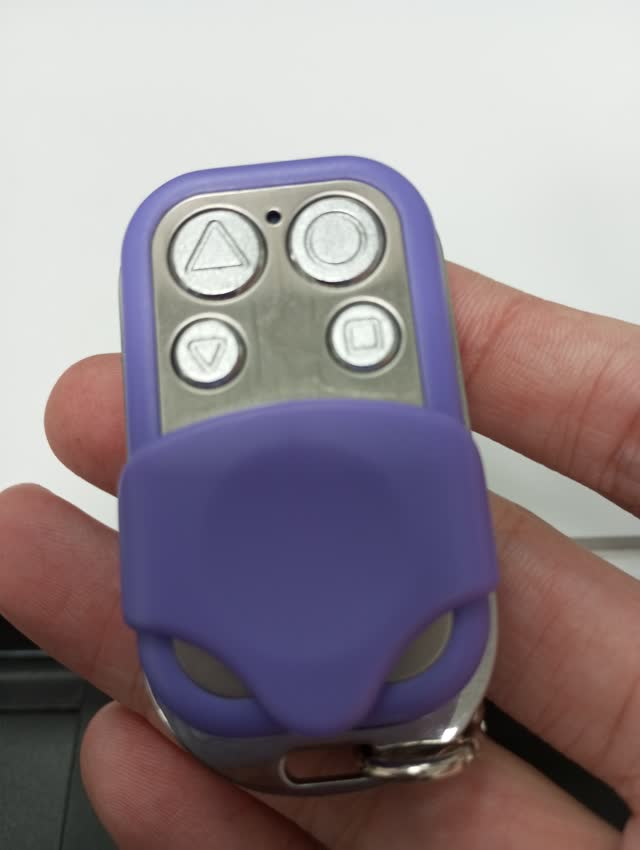
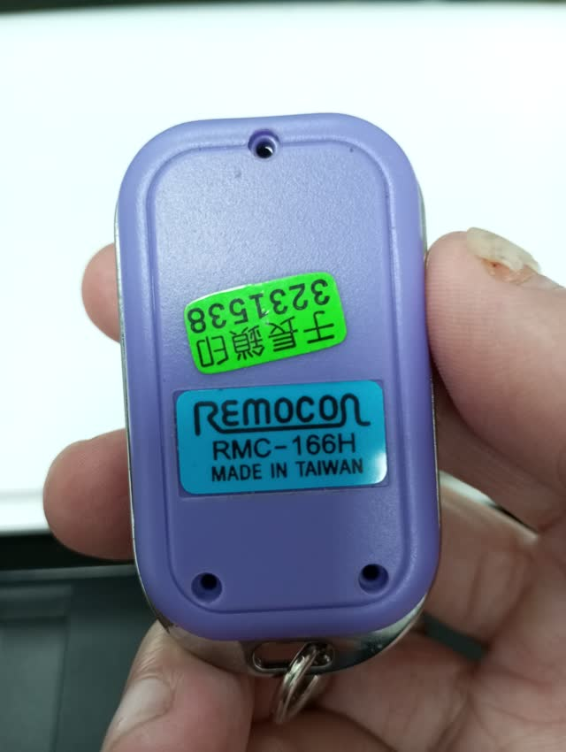

# Garage remote control hacking with GNU Radio

The remote control being hacked is a Remocon RMC-166H.

The rx.grc GNU Radio flowgraph records the RF signal when the buttons of the remote control is pressed. The below video is an example of the results when the flowgraph is run:

<!--  -->
https://github.com/fumin/rfgate/assets/765222/4db72be0-3f69-46c6-bb28-eeeab66ca548


The tx.grc flowgraph plays the recorded signal using a HackRF One.
Below is a real world video of tx.grc opening a physical garage door:

https://www.youtube.com/watch?v=fSLoM5T9G_8

To confirm that the recorded signals are valid, we can use another RTL-SDR to
listen to the transmitted signal from the HackRF One.
In particular, we can run the below [rtl_433](https://github.com/merbanan/rtl_433/) command which prints the decoded signal received from the RTL-SDR:

```
rtl_433 -f 316M -s 2M -X "name=shaoyu,modulation=ook_pwm,short=370,long=772,gap=1500,reset=9000,tolerance=152" -R 131 -vvv
```

Below are photos of the hacked Remocon RMC-166H:


